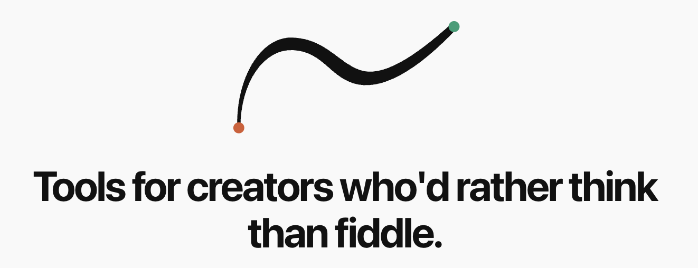
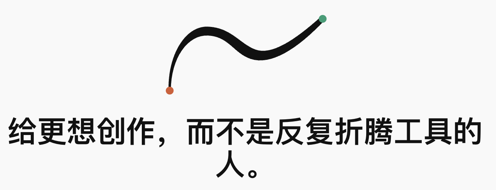

# CueRecord

[](https://github.com/nolangz/CueRecord/releases/latest)
[](https://github.com/nolangz/CueRecord/releases/latest)
[](https://www.swift.org/)
[](LICENSE)

Native macOS screen recorder with teleprompter, camera overlay, system audio capture, 4K export, and AI breath cuts for product demos, tutorials, courses, and presentations.

CueRecord combines high-resolution screen recording, optional camera overlay, microphone and system audio capture, AI-assisted script preparation, and a built-in teleprompter workflow in one desktop app.

It is built for creators, educators, founders, and developers who need to record polished walkthrough videos without stitching together a separate screen recorder, teleprompter app, camera overlay tool, and audio capture setup.

## Nolan Lai

Personal website: [nolanlai.com](https://www.nolanlai.com/)





## Maintenance Note

这是一个已经发布的 project。后续需要改动的时候要非常小心，并测试每一项可能影响的地方。

## Download

Download the latest signed and notarized macOS build:

- [Download CueRecord-v2.0.2.dmg](https://github.com/nolangz/CueRecord/releases/download/v2.0.2/CueRecord-v2.0.2.dmg)
- [Release notes](https://github.com/nolangz/CueRecord/releases/tag/v2.0.2)

## Use Cases

- Product demo videos and SaaS walkthroughs
- Tutorial, course, and training recordings
- Founder updates, launch videos, and pitch recordings
- Developer demos with screen, camera, voice, and system audio
- Scripted presentations that need a teleprompter while recording

## Features

- Native Swift macOS app for full-screen, window, and selected-area recording
- Multi-display support, including external display selection
- Optional camera overlay with draggable preview window
- Microphone and system audio capture
- Single-track mixed audio output in the final composited recording
- Built-in teleprompter with adjustable line count and follow-along behavior
- AI Breath Cuts for adding natural teleprompter line breaks with OpenAI-compatible models
- PowerPoint/PPTX speaker-note import for presentation scripts
- Export resolution presets up to 4K with visible expected output dimensions
- Minimal export progress in the project sidebar
- Raw recording assets organized under `raw_data/` while the final composited movie stays in the project folder
- Developer ID signed, notarized, and stapled DMG for distribution

## Credits

The teleprompter portion of CueRecord is based on [f/textream](https://github.com/f/textream).

## Permissions

CueRecord uses standard macOS privacy permissions:

- Screen Recording: required to capture the selected display, window, or area
- Microphone: required when recording voice or using speech-guided teleprompter behavior
- Camera: required for the camera overlay
- System Audio: required when system audio recording is enabled

You can manage these permissions in macOS System Settings under Privacy & Security.

## Requirements

- macOS 15.7 or later
- Apple Silicon or Intel Mac

## Build From Source

This repository uses Git LFS for bundled model and native library assets. Install Git LFS before cloning or pulling dependencies.

```bash
git lfs install
git clone https://github.com/nolangz/CueRecord.git
cd CueRecord
git lfs pull
```

Build a local debug app:

```bash
xcodebuild \
  -project CueRecord.xcodeproj \
  -scheme CueRecord \
  -configuration Debug \
  -destination 'platform=macOS' \
  build
```

Run focused recording-core checks:

```bash
scripts/run-recording-core-tests.sh
```

## Release Build

`build.sh` creates a universal macOS app, signs it with Developer ID, builds a DMG, submits it to Apple notarization, staples the ticket, and validates the final artifact.

Prerequisites:

- Xcode command line tools
- Developer ID Application certificate installed in Keychain
- Apple notarization credentials saved in a notarytool keychain profile
- Git LFS assets pulled locally

Default release environment:

```bash
TEAM_ID=JKDNYL5U42
SIGN_IDENTITY='Developer ID Application: NUOLIN LAI (JKDNYL5U42)'
NOTARY_PROFILE=cuerecord-notary
```

Create a release DMG:

```bash
./build.sh
```

The output is written to:

```text
build/release/CueRecord.dmg
```

## Project Structure

```text
CueRecord/                App source
CueRecord/Recording/      Recording pipeline, UI, selection, metrics, export organization
Tests/RecordingCoreTests/ Focused command-line checks for recording core behavior
Vendor/                   Git LFS tracked native libraries and local ASR model assets
build.sh                  Signed, notarized release DMG build script
```

## Notes

- Final exported recordings are designed to contain a single mixed audio track.
- Intermediate screen, camera, overlay metadata, and metrics files are kept under `raw_data/`.
- Large bundled assets are tracked with Git LFS and are required for a complete local build.
- Related search terms: macOS screen recorder, teleprompter app, camera overlay recorder, system audio recorder, product demo recorder, tutorial video recorder, 4K screen recording, OpenAI-compatible script editing.

## License

CueRecord is released under the [Apache License 2.0](LICENSE).

## Vibe Creators

欢迎喜欢 vibe create 的朋友加入 Vibe Creators 群。

由于群已经满 200 人了，可以扫我的微信码加群。


